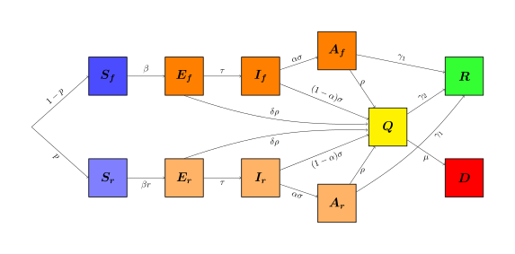

# Covid-19 Model 

In this repository, you'll find the codes used to simulate the COVID-19 model in "A model for COVID-19 with
isolation, quarantine and testing as control measures" [https://arxiv.org/abs/2005.07661](https://arxiv.org/abs/2005.07661), by M. S. Aronna, R. Guglielmi and L. M. Moschen. The repository is organized in this way:

```bash
├── data
│   ├── parameters.yaml
│   ├── r0.txt
│   └── variables
├── images
│   ├── demo2.svg
│   ├── demo3.svg
│   ├── demo4.svg
│   ├── demo.svg
│   ├── demo_T.svg
│   ├── demo_us.svg
│   ├── equation.svg
│   └── model.svg
├── notebooks
│   ├── __init__.py
│   ├── paths.py
│   └── R0Calculation.ipynb
├── pyscripts
│   ├── calc_r0.py
│   ├── dynamics_model.py
│   ├── execute_model.py
│   └── __init__.py
├── README.md
└── requirements.txt
```

You can see the dynamics of the model in "dynamics_model.py". Actually you
can execute the simulation with these steps below:

## Using the execute file 

To test the model, follow the steps.

1. Install Python 3 in your machine.
2. Install the requirements with "pip install -r requirements.txt".
3. Go to the folder "pyscripts".
4. Enter "python exposed_model.py".
5. Change the parameters in data/parameters.yaml.
6. Change the functions beta, r and rho in dynamics file. 
7. Enter 4. command again. 

Ps.: You will save the variables values in data/variables folder, with a name
of your choice. You don't need to put the format, because it's assumed to be
txt. 

## The Model 

### Abstract of the article

 In this article we propose a compartmental model for the dynamics of
 Coronavirus Disease 2019(COVID-19).  We take into account the presence of
 asymptomatic infections and the main policiesthat  have  been  adopted  so
 far  for  the  combat  of  this  disease:  isolation  (or  social
 distancing)  ofa portion of the population,  quarantine for confirmed cases
 and testing.  We model isolation byseparating the population in two groups:
 one composed by key-workers that keep working duringthe  pandemic  and  have
 a  usual  contact  rate,  and  a  second  group  consisting  of  people  that
 areenforced/recommended to stay at home.  We refer to quarantine as strict
 isolation, and it is appliedto confirmed infected cases.
 
 In the proposed model, the proportion of people in isolation, the level of
 contact reduction andthe testing rate are control parameters that can vary in
 time, representing policies that evolve indifferent stages.  We obtain an
 explicit expression for the basic reproduction numberR0in terms ofthe
 parameters of the disease and of the control policies.  In this way we can
 quantify the effect thatisolation and testing have in the evolution of the
 epidemic.  We present a series of simulations toillustrate different
 realistic scenarios.  From the expression ofR0and the simulations we
 concludethat isolation (social distancing) and testing among asymptomatic
 cases are fundamental actions tocontrol the epidemic, and the stricter these
 measures are and the sooner they are implemented, themore lives can be saved.
 Additionally, we show that people that remain in isolation
 significantlyreduce  their  probability  of  contagion,  so  risk  groups
 should  be  recommended  to  maintain  a  lowcontact rate during the course
 of the epidemic. 

 ### The graphic from model 



### System of equations 


### Sugestions

Please, any sugestions make an issue and I will answer as quick as I can. Thanks!

